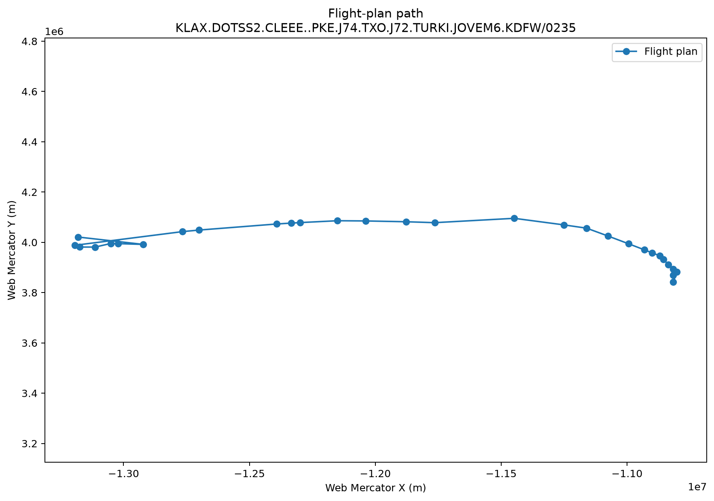

# Converting a flight plan into a latitude/longitude path

`RouteResolver.path()` converts supported domestic FAA route-field text into
an ordered tuple of `(latitude, longitude)` pairs. Reuse one resolver when
processing many routes from the same immutable NASR cycle.

This example uses a longer route from the project's canonical 100-flight-plan
validation sample:

```text
KLAX.DOTSS2.CLEEE..PKE.J74.TXO.J72.TURKI.JOVEM6.KDFW/0235
```

It begins at Los Angeles International Airport, follows the DOTSS2 departure,
traverses jet routes J74 and J72, joins the JOVEM6 arrival, and ends at
Dallas/Fort Worth International Airport. The script prints the resolved
coordinates and plots the same path in Web Mercator meters. Web Mercator makes
the plotted coordinates suitable for overlaying on Google Maps or another
EPSG:3857 tile layer.

Run it with:

```bash
python examples/flight_plan_path.py
```

Edit `route`, `cycle`, `cache_dir`, `output_path`, or `show_plot` in the
configuration block to customize it.

The coordinate output for the documented cycle begins:

```text
Latitude, longitude path:
  33.94249638, -118.40804861
  ...
  32.89723305, -97.03769472
```

## Script

```{literalinclude} ../../examples/flight_plan_path.py
:language: python
:linenos:
```

## Result


