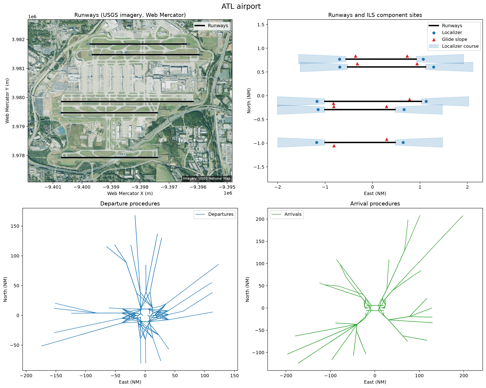

# Plotting an airport

This example loads ATL and creates four independently scaled panels. The first
uses key-free USGS ImageryOnly aerial imagery in Web Mercator; the NASR runway
geometry is drawn in the matching EPSG:3857-compatible coordinates. Keeping
airport-scale runway and ILS data separate from long procedure legs makes each
layer readable:

1. runway threshold-to-threshold segments;
2. ILS localizer and glide-slope component sites, with each localizer's first
   nautical mile shown as a standard approach-course wedge;
3. resolved departure-procedure legs; and
4. resolved arrival-procedure legs.

The script uses one shared `PlottingIndex` and the layer controls on
`plot_airport_procedures()`. The ILS and procedure panels use east/north
nautical miles about the airport's published reference point.

Run it with:

```bash
python examples/plot_airport.py
```

Edit `airport_id`, `cycle`, `cache_dir`, `ils_wedge_distance_nm`,
`output_path`, or `show_plot` in the configuration block to customize it.

## Script

```{literalinclude} ../../examples/plot_airport.py
:language: python
:linenos:
```

## Result


