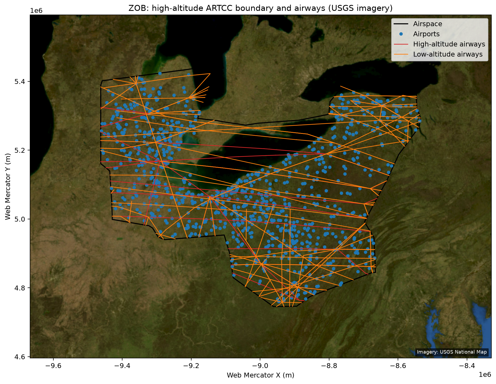

# Plotting an ARTCC

This example retrieves Cleveland Center (`ZOB`) through `nasr.artccs` and calls
the `Artcc.plot()` convenience method. It draws the high-altitude boundary,
contained airports, and intersecting high- and low-altitude airway segments in
Web Mercator, over key-free USGS National Map imagery.

Set `boundary_level = "low"` in the configuration block to select the
low-altitude boundary. Fix and navaid point layers are disabled in this figure
to keep the larger ARTCC view legible.

Run it with:

```bash
python examples/plot_artcc.py
```

Edit `artcc_id`, `boundary_level`, `cycle`, `cache_dir`, `output_path`, or
`show_plot` in the configuration block to customize it.

## Script

```{literalinclude} ../../examples/plot_artcc.py
:language: python
:linenos:
```

## Result


