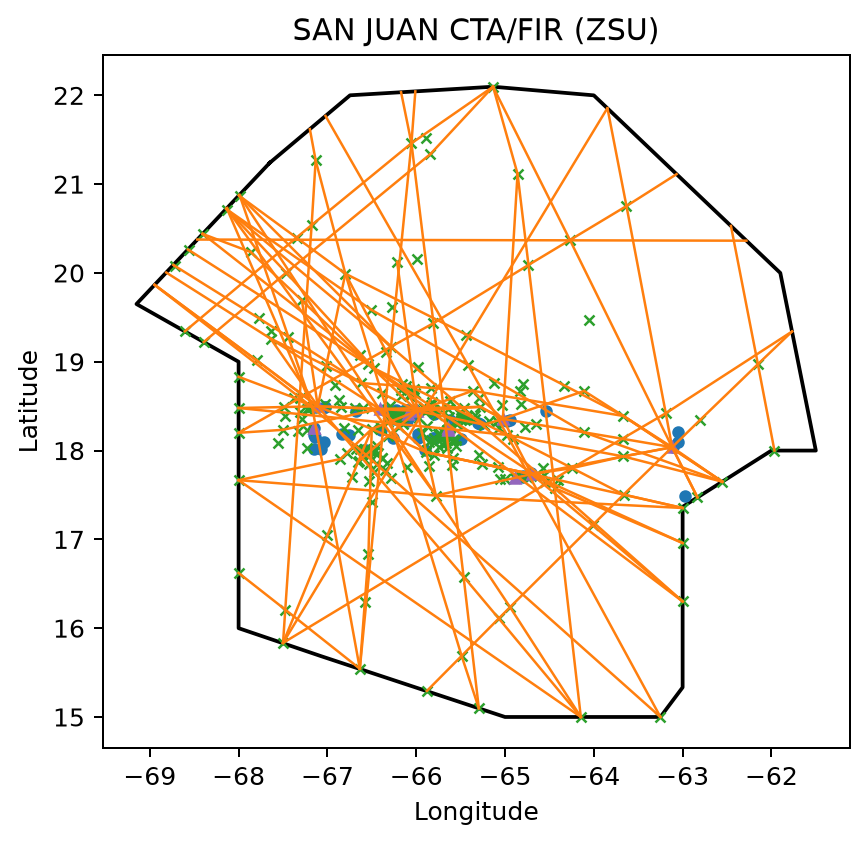

# Plotting an FIR

The FAA boundary tables include Flight Information Region (FIR), CTA/FIR, CTA,
and UTA geometry. This example selects the Honolulu CTA/FIR (`ZHN`) through
`nasr.airspace_boundaries`, then calls its shared `.plot()` method.

Run it with:

```bash
python examples/plot_fir.py
```

## Script

```{literalinclude} ../../examples/plot_fir.py
:language: python
:linenos:
```

## Result


