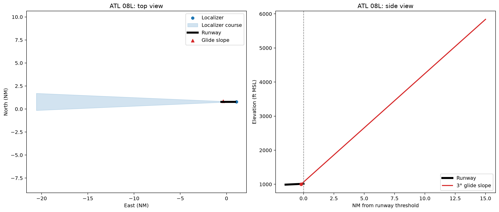

# Plotting an ILS

This example selects the ILS associated with ATL runway end 08L. The top view
shows the runway, localizer transmitter, standard localizer wedge, and
glide-slope site in airport-centered nautical miles. The wedge is 700 feet
wide at the runway threshold and expands at a 2.5-degree half-angle. It extends
20 NM by default; edit `wedge_distance_nm` to change the distance or set
`plot_wedge = False` to hide it. The side view uses runway and site elevations
together with the FAA-published glide-slope angle.

The source rows come from `APT_RWY_END`, `ILS_BASE`, and `ILS_GS`. The diagram
is intended for data exploration and is not an operational approach chart.

Run it with:

```bash
python examples/plot_ils.py
```

The configuration block also exposes `airport_id`, `runway_end_id`, `cycle`,
`cache_dir`, `output_path`, and `show_plot`.

## Script

```{literalinclude} ../../examples/plot_ils.py
:language: python
:linenos:
```

## Result


