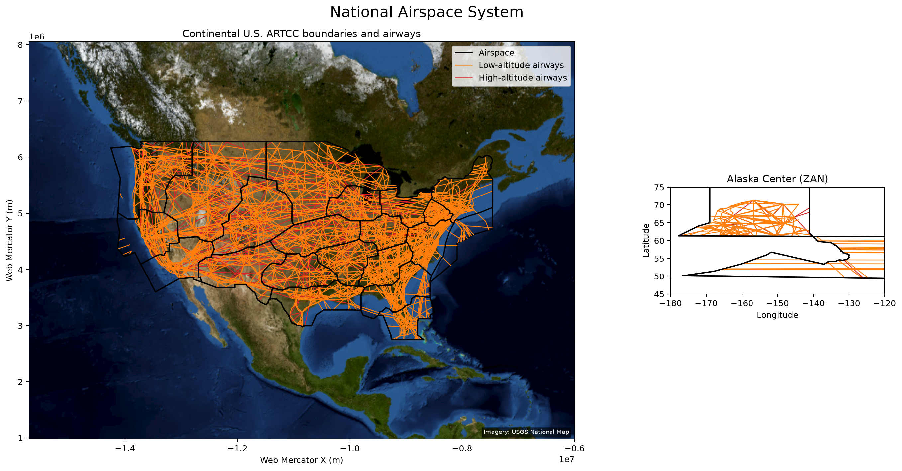

# Plotting the National Airspace System

This example draws every published high-altitude ARTCC boundary together with
the low- and high-altitude airway networks. The continental U.S. is shown in
Web Mercator over key-free USGS National Map imagery. Alaska Center (`ZAN`) is
included in a geographic inset because its published oceanic boundary crosses
the antimeridian and extends to the North Pole.

Run it with:

```bash
python examples/plot_nas.py
```

Edit `cycle`, `cache_dir`, `output_path`, or `show_plot` in the configuration
block to customize it.

## Script

```{literalinclude} ../../examples/plot_nas.py
:language: python
:linenos:
```

## Result


